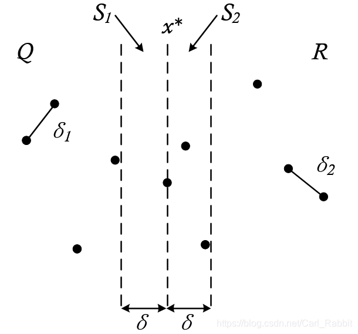
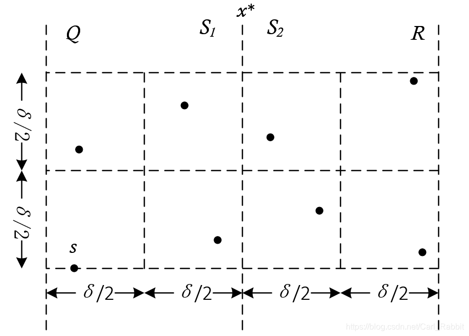

# Oj_Record_1

> 主要使用Divide and conquer思想解决

## A. NEAREST_POINT

> 给定两组平面上的等数量的点的坐标，从中各取一个点，使得其距离最短

衍生自经典的最邻点对问题（即直接给定了一大堆点而没有指定必须一边取一个）

### 经典问题的思路

#### 最简情况

一个点，距离无意义，返回inf

两个点，返回点对长度

三个点，循环比较即可

分治中选择三个点作为终点，只有三个点时循环求解即可

#### 预处理

首先对于一个乱序的点集`P`，我们需要分别对`x`和`y`进行排序，得到$P_x$和$P_y$

 （注意是分别，而不是先后）。前者用于divide，后者用于merge。
#### ***DEVIDE***

##### 拆分

设点集`P`中点的个数为`n`，则从$P_x$中按横坐标进行划分（这里划分在排序后实际上是按下标划分的），假设中间的点就是$x^*$，其左边包括该点被划分到左边，其右边不包括该点被划分到右边

左右分别记为`Q`区和`R`区

##### 维护有序数组

为了维持递归的一致性，需要对左右两部分也维护好$R_y$和$Q_y$，由于已经有了按y坐标排好序的$P_y$

故只需要遍历$P_y$类似于有序链表合并一样，根据x拆分到两边的$R_y$和$Q_y$里，就自然分开了，这部分时间复杂度为$\Theta(n)$

#### ***merge***

假设`Q`区和`R`区找到的最短距离分别为$d_1$和$d_2$，且假设`Q`区和`R`区之间的点对儿最短距离为$d_3$

则需要输出的解为$min(d_i)$，关键来到了怎么算$d_3$上

这里需要注意到，若使用蛮力循环计算$d_3$，所需的时间复杂度仍然为$\Theta(n^2)$，因为两边都还有$\frac{n}{2}$个点需要判断

##### 使用$d_1$和$d_2$来简化对$d_3$的计算

首先取$d=min(d_1,d_2)$，以此作为一个指标，在$x^*$两侧划分一条宽度为$2d$的带记为`S`区，显然对于`S`以外的点，不可能产生比$d$更小的距离，只需考虑在`S`中的所有点



但到这一步还不能放松，因为点的分布完全不知道，实际上可能所有的点都落在`S`中，这样还是得面临$\Theta(n^2)$的时间复杂度

$P_y$在此时派上用场



假设我们要检查点`s`，它属于`Q`区。以它为起点，取出`S`区域中高为`d`的一块区域。然后如上图所示，我们可以把这块$d\times 2d$的区域划分为8个`box`。一个`box`内最远距离是对角线距离$\frac{d}{\sqrt{2}}<d$，由于这八个`box`都分别在`Q`区`R`区，可以知道每个`box`中不能存在距离小于`d`的点对儿，故，这样的`box`中最多只能有一个点，，由抽屉原理，八个`box`里最多放八个点，除去`s`自身，可能会产生$d_3$的点对儿只会在这最多七个点中产生，这七个点以外的点必然超过了这8个`box`的范围，又因为是按序遍历的，也就是说下面的`box`在之前的遍历中就已经检查过了，故只需要管上方这8个`box`

实际上可以看出，这里建模很不精确，能完美表达的建模起码得是一堆圆之间的交互，但是能压缩到常数个点的比较已经足够了。

##### 具体实现

维护一个数组`S`，遍历一次$P_y$并且按顺序加入即可，判断标准为$P_y$中的点若满足$x$坐标在$[x^*-d,x^*+d]$内，则加入`S`中，由于$P_y$是有序的，故这样取出来的子集`S`也是有序的

下一步遍历`S`中的点，每个点不需要去遍历寻找符合条件的可能的点，只需要无脑向上找7个点即可。

这样维护`S`和遍历寻找$d_3$的时间复杂度都为$\Theta(n)$

#### 复杂度分析

由以上分析，时间复杂度可以写为
$$
\begin{equation}
T(n)=
\begin{array}{cl}
2T(\frac{n}{2}) + \Theta(n)& & {n > 3}\\
\Theta(1) & & {n \leq 3}\\
\end{array}
\end{equation}
$$
使用主方法容易看出时间复杂度为$\Theta(nlogn)$

### 迁移思路

其实只用对输入点进行分类，给定的两个组作为一个新的属性在point的结构体里进行标注，然后把所有输入的点不分组别地放在一起混合后进行计算处理，仅在在计算点之间的distance时对输入的两个点进行判断，若为同组点，则距离赋为$\infin$即可。

## B. Antiarithmetic_Permutation

> 给定正整数n，输出0...n-1的一个排列，使得其中不存在长度大于2的构成等差数列的子序列

### 思路

将这样的排列序列记录为AAS(n)

如果取三个数能构成等差数列，则只有四种情况：

三个偶数 三个奇数 奇数偶数奇数 偶数奇数偶数

如果将数按偶数一组奇数一组顺序排列，则不会出现后两组

故而只需要保证在偶数和奇数那两堆不出现等差数列即可

将偶数数组记为{$a_n$}，奇数数组记为{$b_n$}

则{$\frac{a_n}{2}$}和{$\frac{b_n-1}{2}$}仍然保证不存在等差数列

且这两个新构造的数列，容易看出也是从开始的连续自然数构成的序列，即为AAS($n_1$)和ASS($n_2$)

以n = 10为例

0 1 2 3 4 5 6 7 8 9先按偶数和奇数分组

↓

0 2 4 6 8 | 1 3 5 7 9

↓ 对应

0 1 2 3 4 | 0 1 2 3 4

↓ 对应

AAS(5) | AAS(5)

即只用解决子问题即可以映射拼接得到新的解


### 解析

始终保证偶数组在前，奇数组在后的排列给出以下排列模式

n = 1对应序列 `0`

n = 2对应序列 `0 1`

n = 3对应序列 `0 2 1`

n = 4 -> AAS(2)偶拓展 | AAS(2)奇拓展 -> 0 2 | 1 3

n = 5 -> AAS(3)偶拓展 | AAS(2)奇拓展 -> 0 4 2 | 1 3

....

n = 2k -> AAS(k)偶拓展 | AAS(k)奇拓展

n = 2k + 1 -> AAS(k+1)偶拓展 | AAS(k)奇拓展


n = 6 -> AAS(3)even | AAS(3)odd -> 0 4 2 | 1 5 3

n = 8 -> AAS(4)even | AAS(4)odd -> 0 4 2 6 | 1 5 3 7

故，给定n=1，2，3的终结状态，之后对于其余的输入，分为奇数偶数两组，依次分下去并进行奇偶拓展即可拼接得到

```c++
ComputeAAS:
  computeAAS(odd_part);
  computeAAS(even_part);
  oddExtend(odd_part);
  evenExtend(even_part);
  output: even_part | odd_part
  end;
```

## C. Subset_Sum_Problem

> 给定整数集{$a_n$}和sum，从中取子集，使得子集中所有元素的和为sum

### 剪枝 ×

直接遍历后用各种条件剪枝。但尝试了各种剪枝方法最终都超时了

失败的尝试：

1. 若当前重量已经超过了目标，剪枝
2. 若剩下所有的重量都不足够达成目标，剪枝

感觉最有效的就是这两个，但是无法降低时间复杂度到需要的范围内

### 动态规划×

动态规划是从[0...sum]建立一个bool数组，遍历一遍所有物品就能判断能否得到特定的组合，最终的时间复杂度为$\Theta(n\cdot sum)$，空间复杂度为$\Theta(sum)$，故在OJ条件的$0 ≤ D ≤ 3\times10^{10}$下会直接爆空间，只能放弃

### meet in the middle暴力 √

适用于n不大的情况（比如OJ这里1 ≤ N ≤ 30），使用折半查找直接将时间复杂度从$\Theta(2^n)$砍到$\Theta(2^{\frac{n}{2}})$，在n不大的情况下能显著降低时间（但实际上其对半砍的非常粗暴，甚至可以理解成是一种偷鸡方法）

核心想法是物品分成两半，穷举生成两半的子集和，用时$2\Theta(2^{\frac{n}{2}})$，遍历左半边，右半边则排序后用折半查找，查找用时$\Theta(\frac{n}{2})$由于n不大，可以认为是$\Theta(1)$，故只用考虑遍历的时间复杂度，为$\Theta(2^{\frac{n}{2}})$，这样总结下来整体的时间复杂度降至$\Theta(2^{\frac{n}{2}})$相比于剪枝从$\Theta(2^n)$的时间复杂度玄乎未定的剪枝，折半确实降低了相当多的复杂度，事实上最终也是靠折半查找实现了ac

